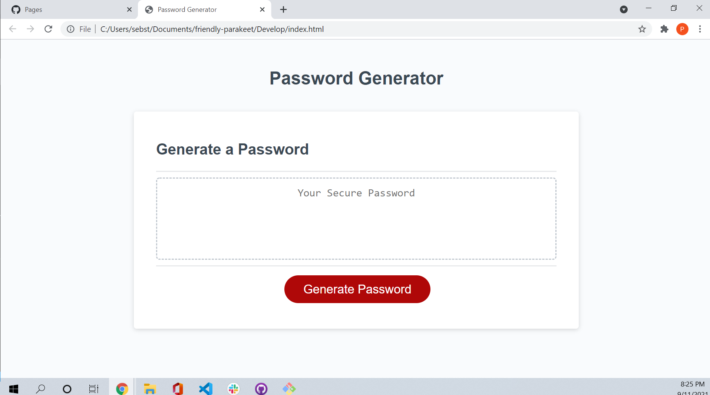
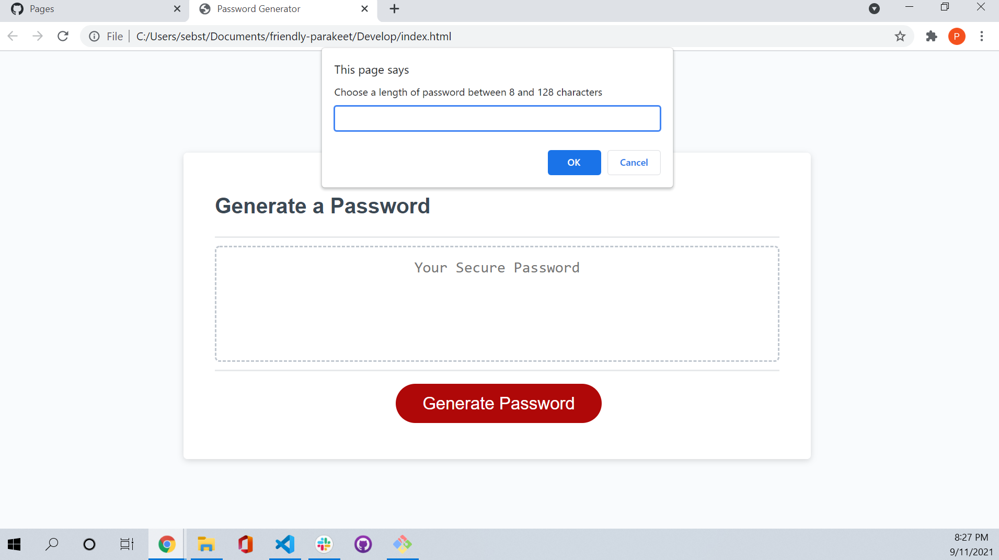
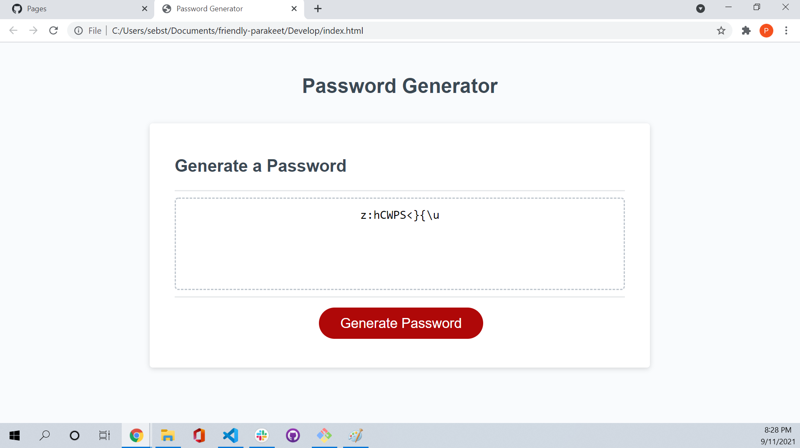

# Password Generator Starter Code

Discription:
The project was to build the JavaScript logic to generate a password with the following user selected criteria:
* password length
* if the user wants to use uppercase or lowercase letters
* if the user wants to use numbers
* if the user wnats to use special characters
these selections needed to be confirmed by the user and the randomly generated password needed to be displayed in a alert or in the page's textbox.

Screenshots :

Deployed URL: https://raidernationbuilder.github.io/friendly-parakeet/